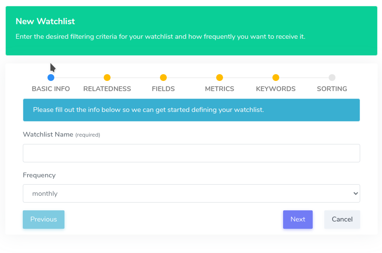
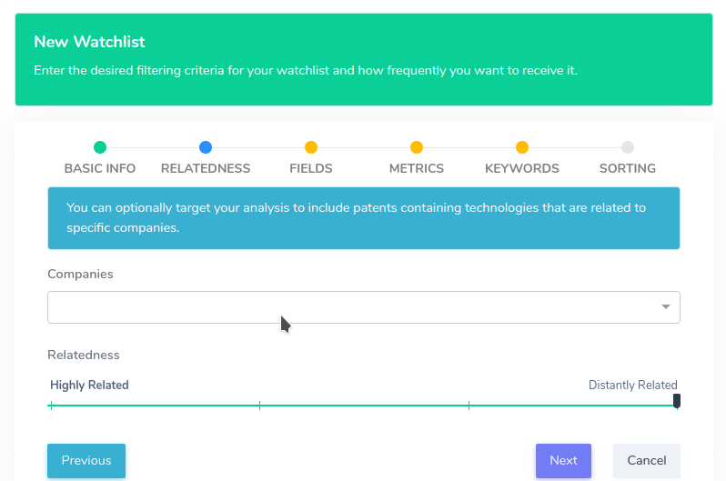
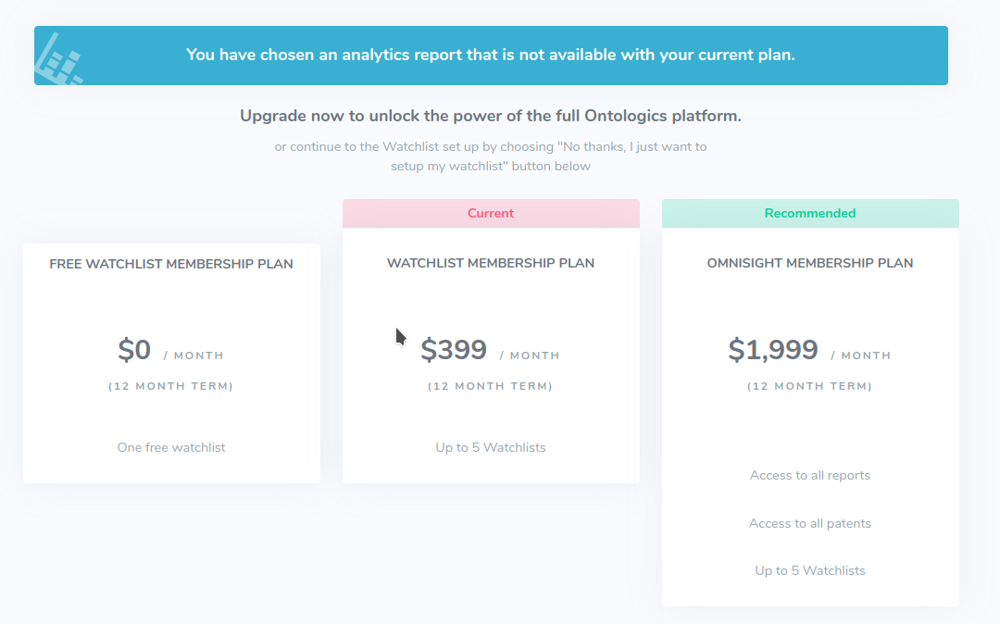
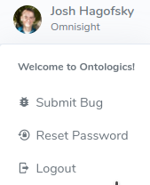
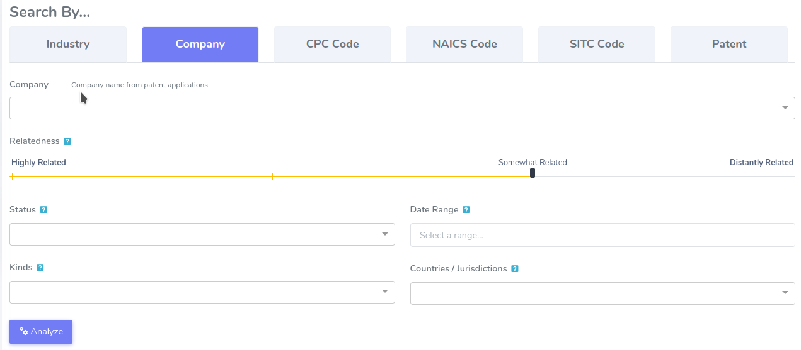
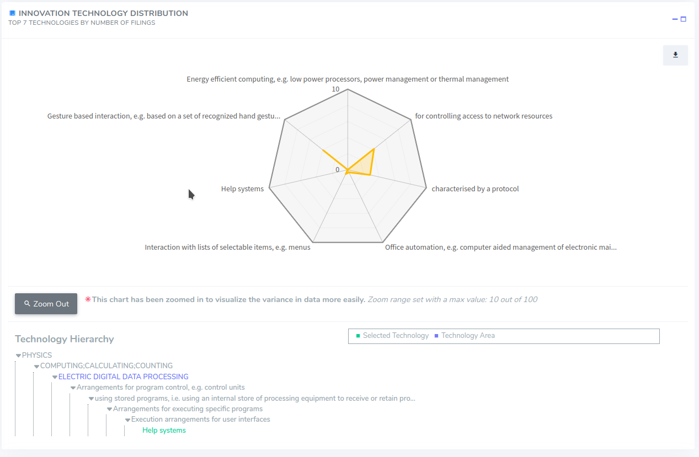
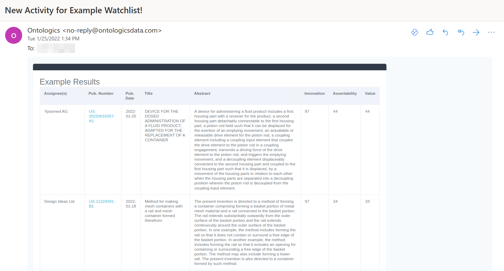
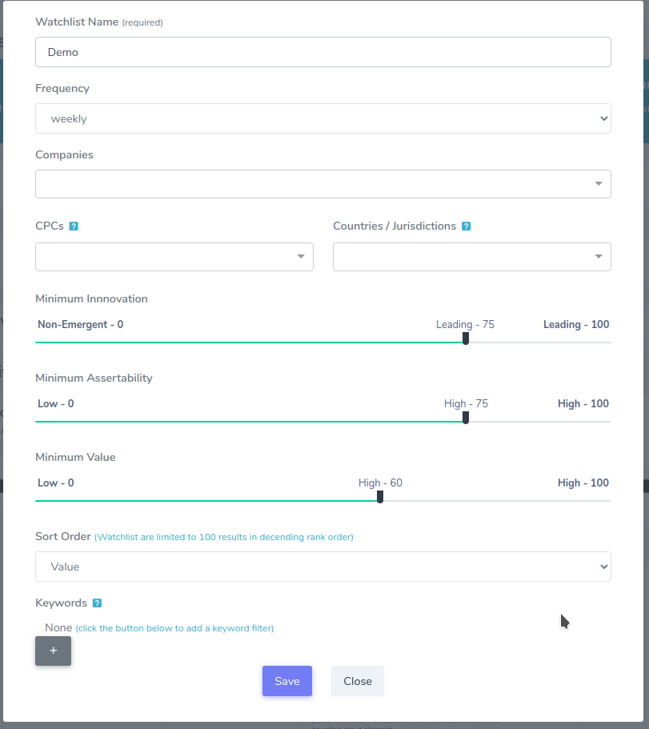

# 2022.03.23
## Features
* ### Watchlist Improvements
   * Watchlist creation form replace with a wizard for better usability. 
   * Added company relatedness.  

* ### New Plans
  * Added Free Watchlist Plan and Watchlist Plan 

* ### Submit Bug
   * If an error on a page id detected, a bug report will automatically be filed.
   * Users can submit bug reports by clicking "Submit Bug" in the user menu. 
   
   

# 2022.03.01
## Features
* ### Industry Report Improvements
   * Custom Industry by company updated to only use Technology Areas that make up 80% of the company's portfolio
   * Added Relatedness range slider to Custom Industry by Company, CPC Code, and Patent to allow user to specify how closely related the technologies in the custom industry are to the original selection. 
   * Removed vague Technology Area from search results
* ### Technology Hierarchy Added
  * Ability to click on a technology to see the hierarchy, which allows for a better explanation of what the technology is, and how it relates to a Technology Area 

## Bug Fixes
* Unsubscribe link in watchlist email does not work.

# 2022.02.17 (Hotfix)
## Bug Fixes
- Spelling issues on <a href="https://portal.ontologicsdata.com/home/company">Home - Company</a> page.

# 2022.02.16.1 (Hotfix)
## Bug Fixes
- Patent charts ignore date range and kind filters. Introduced in <a href="#2022.02.16">2022.02.16</a>

# 2022.02.16
## Features

* ### Added <a href="https://portal.ontologicsdata.com/company/age">Company Age Report</a> 

   * Review the expected expiration of a portfolio
   * Find out how their expiration funnel stacks up
   * See which technical areas are set to expire sooner or later
   
## Bug Fixes
- Technology comparison charts not grouping companies in company reports. So only first selected company's average score was shown.

# 2022.02.09 (Hotfix)
## Bug Fixes
- Lazy load `Description` and `Claims` fields in <a href="https://portal.ontologicsdata.com/patent/search">Patent Search</a> to alleviate timeout issue

# 2022.02.08 (Hotfix)
## Bug Fixes
- Fixed bug in Filterbar that prevents users from adding a competitor to the <a href="https://portal.ontologicsdata.com/competitor/overview">Competitor Reports</a>

# 2022.01.24 
## Features

* ### Added <a href="https://portal.ontologicsdata.com/watchlist">Watchlists</a> 

    * Get weekly/monthly/quarterly updates when new patent documents are published
    * Filter by company, keywords, countries, CPC codes, assertability, innovation, and value 

