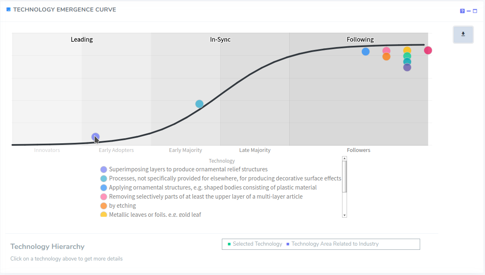
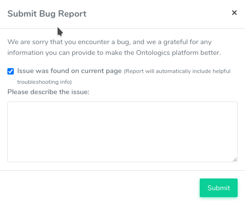

# 2022.09.14 
## Features
* Value V2
  * GDP Added to Value Calculation
  * GDP toggle to exclude from value calculation on relevant charts

  * Value reports aligned with assertability and innovation reports
* UI Improvements
  * Updated Scorecard quadrant text to be more clear

## Frontend Framework Update
  * Upgrade to Angular 13
  * Applied multiple security updates

# 2022.08.15 
## Features
* UI Update
  * Chart type toggles
  * Count vs Percentage toggles

# 2022.08.15 
## Features
* UI Update
  * Unified interaction buttons to the right side (gutter)
  * Added more help info

# 2022.08.01 
## Features
* Menu Restructure
  * Overview first
  * Everything else alphabetized

* Chart Context Menu
  * Show table of patents

  * Set relevant filters

* Table pagination, filtering, and sorting

# 2022.08.01 
## Features
* Agent Report (Beta)
  * Patent Distribution by Agent
  * Patent Timeline by Agent
  * Scorecard by Agent

* Inventor Report (Beta)
  * Patent Distribution by Inventor
  * Patent Timeline by Inventor
  * Scorecard by Inventor

# 2022.05.24 (Hotfix)
## Features
- Australian Patents

## Bug Fixes
- Clarify Industry Value Quadrant until better representation is determined.
  

# 2022.05.16 
## Features
* Foresight Plan
  * $999 per month
  * Restricted to US patents

# 2022.05.03 (Hotfix)
## Features
- Watchlist plan pricing update to $99/month

## Bug Fixes
- Technology emergence chart not loading
- Technology emergence chart using v1 emergence data

# 2022.05.02
## Features
 * Innovation V2 
   * False emergence detection
   * Multiple emergence support
 * Technology Emergence 
 
  
 
 
 * Clear Filters  
 
 * Chart Export Naming

 

# 2022.04.18
## Features
- One Time Report Plan. 
   - Allow for users to purchase a bundle of 3 reports.

   - Report history to easily access previously purchased non expired reports.

# 2022.03.31
## Features
- Allow for filtering by cpc by searching description rather than typing cpc directly in Company, Competitor, and Watchlist. 

# 2022.03.30 (Hotfix)
## Bug Fixes
- Patent showing up multiple times in patent search due to multiple abstract sources.
- Emergence chart nodes linking to patent search page

# 2022.03.23
## Features
* ### Watchlist Improvements
   * Watchlist creation form replace with a wizard for better usability. 
   * Added company relatedness.  

* ### New Plans
  * Added Free Watchlist Plan and Watchlist Plan 

* ### Submit Bug
   * If an error on a page id detected, a bug report will automatically be filed.
   * Users can submit bug reports by clicking "Submit Bug" in the user menu. 
   
   

# 2022.03.01
## Features
* ### Industry Report Improvements
   * Custom Industry by company updated to only use Technology Areas that make up 80% of the company's portfolio
   * Added Relatedness range slider to Custom Industry by Company, CPC Code, and Patent to allow user to specify how closely related the technologies in the custom industry are to the original selection. 
   * Removed vague Technology Area from search results
* ### Technology Hierarchy Added
  * Ability to click on a technology to see the hierarchy, which allows for a better explanation of what the technology is, and how it relates to a Technology Area 

## Bug Fixes
* Unsubscribe link in watchlist email does not work.

# 2022.02.17 (Hotfix)
## Bug Fixes
- Spelling issues on <a href="https://portal.ontologicsdata.com/home/company">Home - Company</a> page.

# 2022.02.16.1 (Hotfix)
## Bug Fixes
- Patent charts ignore date range and kind filters. Introduced in <a href="#2022.02.16">2022.02.16</a>

# 2022.02.16
## Features

* ### Added <a href="https://portal.ontologicsdata.com/company/age">Company Age Report</a> 

   * Review the expected expiration of a portfolio
   * Find out how their expiration funnel stacks up
   * See which technical areas are set to expire sooner or later
   
## Bug Fixes
- Technology comparison charts not grouping companies in company reports. So only first selected company's average score was shown.

# 2022.02.09 (Hotfix)
## Bug Fixes
- Lazy load `Description` and `Claims` fields in <a href="https://portal.ontologicsdata.com/patent/search">Patent Search</a> to alleviate timeout issue

# 2022.02.08 (Hotfix)
## Bug Fixes
- Fixed bug in Filterbar that prevents users from adding a competitor to the <a href="https://portal.ontologicsdata.com/competitor/overview">Competitor Reports</a>

# 2022.01.24 
## Features

* ### Added <a href="https://portal.ontologicsdata.com/watchlist">Watchlists</a> 

    * Get weekly/monthly/quarterly updates when new patent documents are published
    * Filter by company, keywords, countries, CPC codes, assertability, innovation, and value 

